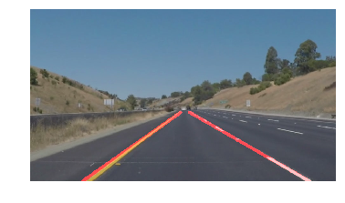

# **Finding Lane Lines on the Road** 
[](http://www.udacity.com/drive)


Overview
---
This is jupyter-notebook to find lane lines on the road.
This detection program uses only fundamental computer vision techniques(Canny edge detection, Hough transformation).



Requirements
---
- opencv-python==3.4.0.12
- numpy==1.11.1
- matplotlib==2.0.2
- moviepy==0.2.3.4
- jupyter-notebook
- python3

Files
---
- P1.ipynb : main jupyter notebook to detect lanes
- writeup.md : Explaining my approach for this task
- test_images : test images
- test_videos : test videos
- test_images_output : detection result for the images
- test_videos_output : detection result for the videos
- README.md


How to use
---
Please run all cells in P1.ipynb

```
jupyter-notebook P1.ipynb
```

